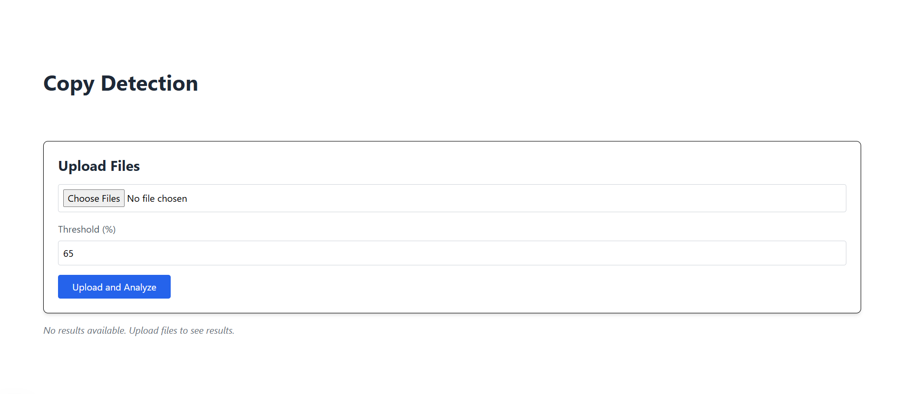
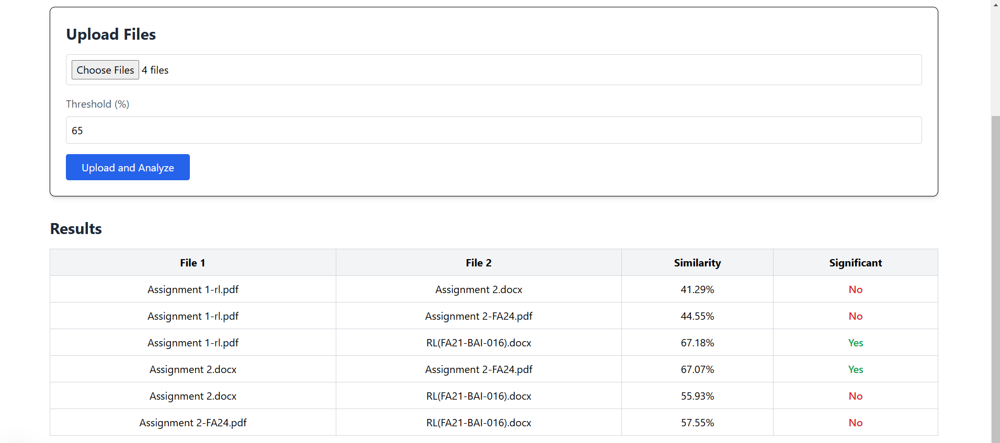

# Plagiarism Detection App Between Documents

## Overview
This is a full-stack plagiarism detection web application built using **React (Next.js)** for the frontend and **FastAPI** for the backend. The app allows users to upload multiple documents and check the similarity between them. It is designed for scenarios like academic or content plagiarism detection.

---

## Features
- Upload multiple files (`.txt`, `.pdf`, `.docx`) to check similarity.
- Adjust similarity threshold percentage to filter results.
- Clear and detailed similarity results between files, including "significant" status.
- Modern, user-friendly interface with file upload and result display.
- Backend API for advanced plagiarism detection using TF-IDF and cosine similarity.

---

## Screenshots

### 1. **Homepage**


### 3. **Results Display**


---

## Tech Stack
### Frontend:
- React (Next.js)
- TailwindCSS (for styling)

### Backend:
- FastAPI
- Libraries:
  - `scikit-learn` for TF-IDF and cosine similarity calculations.
  - `PyMuPDF` for extracting text from PDFs.
  - `python-docx` for extracting text from Word documents.
  - `chardet` for encoding detection in text files.
  - `CORS` middleware for frontend-backend communication.

---

## Installation

### Prerequisites
1. **Node.js** (for the frontend)
2. **Python 3.8+** (for the backend)
3. **Virtual Environment** (recommended for Python dependencies)

---

### Frontend Setup
1. Navigate to the frontend directory:
   ```bash
   cd frontend
   ```
2. Install dependencies:
   ```bash
   npm install
   ```
3. Run the development server:
   ```bash
   npm run dev
   ```
4. Visit the app at `http://localhost:3000`.

---

### Backend Setup
1. Navigate to the backend directory:
   ```bash
   cd backend
   ```
2. Create and activate a virtual environment:
   ```bash
   python -m venv venv
   source venv/bin/activate  # For Linux/Mac
   venv\Scripts\activate     # For Windows
   ```
3. Install dependencies.
   
4. Start the server:
   ```bash
   uvicorn app.main:app --reload
   ```
5. Visit the API documentation at `http://127.0.0.1:8000/docs`.

---

## Usage
1. Open the app at `http://localhost:3000`.
2. Upload multiple files (`.txt`, `.pdf`, or `.docx`).
3. Set the similarity threshold percentage.
4. Click "Upload and Analyze" to view results.

---

## License
This project is licensed under the MIT License.

---

## Contributing
Contributions are welcome! Feel free to submit a pull request or open an issue for any bugs or feature requests.
